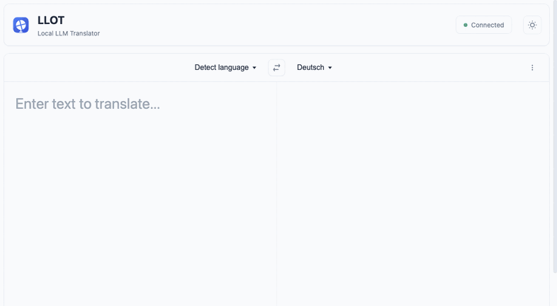

# 🌐 LLOT - Local LLM Ollama Translator

> **Privacy-first AI translation service powered by local LLM models**  
> ✨ No API keys • No cloud services • No data collection • 100% self-hosted ✨

[](https://github.com/pawelwiejkut/llot)
[](https://github.com/pawelwiejkut/llot)
[](https://github.com/pawelwiejkut/llot)

---

## 🎬 Live Demo


*Live demonstration: Real-time translation, language switching, tone selection, and dark mode*

---

## ✨ Why Self-Hosters Love LLOT

| 🔒 **Complete Privacy** | ⚡ **Lightning Performance** | 🏠 **Homelab Perfect** |
|:---:|:---:|:---:|
| Your data never leaves your network | Instant translation with local AI | Docker deployment in 5 minutes |
| Zero cloud dependencies | Real-time as-you-type translation | Uses your existing Ollama server |
| No external API calls | Smart language auto-detection | Lightweight Python Flask app |

| 🌍 **65+ Languages** | 🔊 **Neural TTS** | 🎛️ **Full Control** |
|:---:|:---:|:---:|
| Major world languages supported | High-quality speech synthesis | Choose your AI models |
| Auto language detection | 20+ TTS voices available | Configurable tone & style |
| European languages included | Crystal-clear pronunciation | Your hardware, your rules |

---

## 🚀 Quick Start

### 🎯 Option 1: Use Your Existing Ollama Server
```bash
git clone https://github.com/pawelwiejkut/llot.git
cd llot

# Configure your Ollama server
echo "OLLAMA_HOST=http://your-ollama-server:11434" > .env
echo "OL_MODEL=qwen2.5:3b" >> .env

# Start LLOT
docker-compose up -d

# Access at http://localhost:8080
```

### 🔧 Option 2: Standalone with Everything Included
```bash
git clone https://github.com/pawelwiejkut/llot.git
cd llot

# Includes Ollama + Wyoming Piper TTS + LLOT
docker-compose -f docker-compose.full.yml up -d

# Access at http://localhost:8080
# First run will download models (may take time)
```

That's it! 🎉 **Your private translation service is running.**

---

## 🎛️ Key Features

- ✅ **Real-time translation** as you type
- ✅ **65+ languages** with auto-detection  
- ✅ **Multiple tones** (formal, casual, technical, etc.)
- ✅ **Text-to-speech** for pronunciation
- ✅ **Dark/light theme** toggle
- ✅ **Mobile responsive** design
- ✅ **Translation history** and alternatives
- ✅ **Modern clean UI** inspired by professional services

---

## 🔧 Requirements

### Minimum System Requirements
- **RAM**: 4GB+ (8GB+ recommended for larger models)
- **Storage**: 5GB+ free space for models
- **CPU**: Any modern CPU (ARM64/AMD64 supported)
- **Docker**: Docker and Docker Compose

### Recommended Setup
- **Existing Ollama server** with translation-capable models
- **Optional**: Wyoming Piper for text-to-speech
- **Optional**: Reverse proxy (Nginx, Traefik) for HTTPS

---

## 🌐 Supported Languages

**Major languages**: English, Chinese, Spanish, French, German, Italian, Portuguese, Russian, Japanese, Korean, Arabic, Hindi, Polish, Dutch, and 50+ more.

**Auto-detection**: Automatically detects input language, or choose manually from dropdown.

**Language filtering**: Configure only the languages you need via environment variables.

---

## 🔊 Text-to-Speech

High-quality neural voices for 20+ languages via Wyoming Piper:
- English (US), German, French, Spanish, Portuguese
- Polish, Italian, Dutch, Russian, and more
- Crystal-clear pronunciation with natural intonation

---

## 🐳 Docker Configuration

### Standard Setup (docker-compose.yml)
```yaml
version: '3.8'
services:
  llot:
    build: .
    ports:
      - "8080:8080"
    environment:
      - OLLAMA_HOST=http://your-ollama:11434
      - OL_MODEL=qwen2.5:3b
    restart: unless-stopped
```

### Environment Variables
```bash
# Required
OLLAMA_HOST=http://localhost:11434  # Your Ollama server
OL_MODEL=qwen2.5:3b                # Translation model

# Optional  
APP_PORT=8080                      # LLOT port
WYOMING_PIPER_HOST=localhost       # TTS server
WYOMING_PIPER_PORT=10200          # TTS port
DEBUG_LOGGING=false               # Debug mode
```

---

## 🚨 Troubleshooting

**Translation not working?**
- Verify Ollama is running: `curl http://your-ollama:11434/api/tags`
- Check if your model supports translation
- Look at LLOT logs: `docker-compose logs -f llot`

**TTS not working?**
- TTS is optional - translation works without it
- Check Wyoming Piper is running if configured

**Need help?** Check our [complete documentation](DOCUMENTATION.md) or [open an issue](https://github.com/pawelwiejkut/llot/issues).

---

## 📚 Documentation

- 📖 **[Complete Documentation](DOCUMENTATION.md)** - Detailed setup, configuration, API docs
- 🧪 **[Testing Guide](DOCUMENTATION.md#-testing--quality)** - How to run tests
- 🔧 **[Development Guide](DOCUMENTATION.md#-development)** - Contributing and local development
- 🌐 **[API Documentation](DOCUMENTATION.md#-api-documentation)** - REST API reference

---

## ⭐ Support the Project

If LLOT helps you achieve translation privacy and independence:

- ⭐ **Star this repository** to show your support
- 🐛 **Report issues** to help improve quality
- 🔧 **Contribute** code or documentation
- 🌍 **Share** with the self-hosting community

---

## 🙏 Acknowledgments

Built with ❤️ for the self-hosting community using:
- **[Ollama](https://ollama.com)** - Local LLM deployment made simple
- **[Wyoming Piper](https://github.com/rhasspy/wyoming-piper)** - Excellent local TTS
- **[Flask](https://flask.palletsprojects.com)** - Robust Python web framework

---

<div align="center">

**🏠 Made for Self-Hosters, by Self-Hosters**

**🔒 Your Data • 🏠 Your Network • ⚡ Your Speed**

[🚀 Quick Start](#-quick-start) • [📖 Documentation](DOCUMENTATION.md) • [🐛 Issues](https://github.com/pawelwiejkut/llot/issues)

</div>