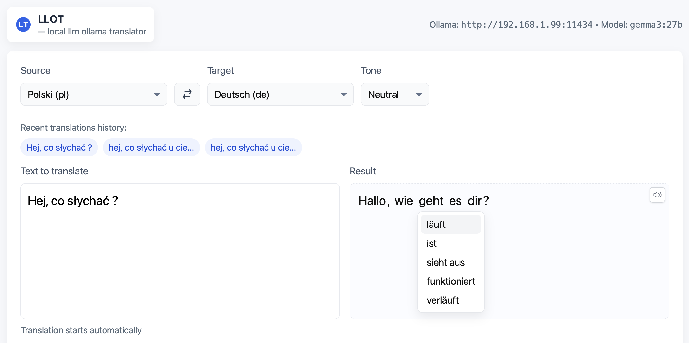
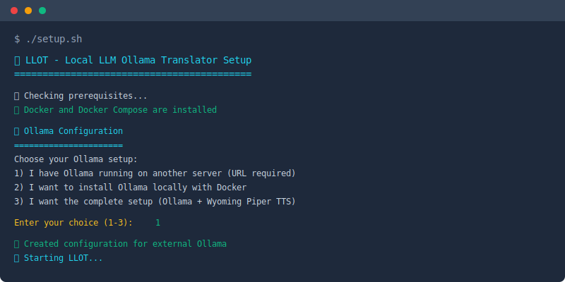

# 🌐 LLOT - Local LLM Ollama Translator

> **Privacy-first translation service for self-hosters**  
> No API keys • No cloud services • No data collection • 100% local

[](https://github.com/pawelwiejkut/llot)
[](https://github.com/pawelwiejkut/llot)
[](https://github.com/pawelwiejkut/llot)

## ✨ Why Self-Hosters Love LLOT

| 🔒 **Total Privacy** | ⚡ **Lightning Fast** | 🏠 **Homelab Ready** |
|:---:|:---:|:---:|
| Your data never leaves your network | Real-time translation as you type | Docker deployment in minutes |

| 🌍 **40+ Languages** | 🔊 **Neural TTS** | 🔧 **Your Infrastructure** |
|:---:|:---:|:---:|
| Multilingual interface + smart detection | High-quality speech for 20+ languages | Use existing servers or install locally |  


*Real-time translation with smart language detection and neural TTS*

---

## 🚀 Quick Start

### Option 1: Guided Setup (Recommended)
```bash
git clone https://github.com/pawelwiejkut/llot.git
cd llot
./setup.sh  # Interactive setup wizard
```


*Interactive setup wizard guides you through configuration*

### Option 2: One-Line Deploy
```bash
# With your existing Ollama server
git clone https://github.com/pawelwiejkut/llot.git && cd llot
echo "OLLAMA_HOST=http://your-ollama-server:11434" > .env
docker-compose up -d
```

### Option 3: Complete Local Setup
```bash
# Installs everything locally (Ollama + Wyoming Piper)
git clone https://github.com/pawelwiejkut/llot.git && cd llot
docker-compose -f docker-compose.full.yml up -d
```

**🎯 Access LLOT:** http://localhost:8080

---

## 🏗️ Architecture Options

Choose what fits your homelab:

### 🌐 **Microservices** (Recommended)
```yaml
LLOT: Docker container
Ollama: External server (your existing setup)
Wyoming Piper: External server (optional TTS)
```
**Perfect for:** Existing homelab infrastructure, resource optimization

### 🖥️ **All-in-One**  
```yaml
LLOT + Ollama + Wyoming: Single docker-compose
```
**Perfect for:** New deployments, single-server setups

### ☁️ **Hybrid Cloud**
```yaml
LLOT: Local Docker
Ollama: Cloud GPU instance
Wyoming: Local container
```
**Perfect for:** GPU acceleration with local privacy

---

## ⚙️ Configuration

### Quick Config (.env)
```bash
# Your Ollama server
OLLAMA_HOST=http://your-ollama-server:11434
OL_MODEL=gemma3:27b

# Optional: Wyoming Piper for TTS
WYOMING_PIPER_HOST=your-piper-server
WYOMING_PIPER_PORT=10200

# Optional: Limit languages
TRANSLATION_LANGUAGES=en,de,pl,es,fr
```

### Recommended Models
- **`gemma3:27b`** - Best quality (32GB RAM)
- **`llama3:8b`** - Balanced (8GB RAM)
- **`mistral:7b`** - Lightweight (4GB RAM)

---

## 🔊 Text-to-Speech Support

**✅ Supported Languages (20):**  
🇺🇸 🇩🇪 🇫🇷 🇪🇸 🇵🇹 🇳🇱 🇩🇰 🇫🇮 🇳🇴 🇵🇱 🇨🇿 🇸🇰 🇭🇺 🇷🇴 🇷🇺 🇸🇦 🇮🇳 🇹🇷 🇻🇳 🇨🇳 🇮🇩

*TTS button appears automatically for supported languages*

---

## 🛠️ For Developers

### Local Development
```bash
python -m venv venv
source venv/bin/activate  # Windows: venv\Scripts\activate
pip install -r requirements.txt
cp .env.example .env  # Configure your servers
python run.py
```

### API Endpoints
```bash
POST /api/translate     # Main translation
POST /api/tts          # Text-to-speech  
POST /api/alternatives # Word alternatives
POST /api/history/save # Save translation
```

### Common Issues

**Can't connect to Ollama?**
- Check `OLLAMA_HOST` in your `.env` file
- Verify Ollama is running: `curl http://your-ollama:11434/api/tags`
- For Docker Desktop: use `host.docker.internal:11434`

**TTS not working?**  
- Verify `WYOMING_PIPER_HOST` is set correctly
- Check if your language is supported (see TTS section above)
- TTS button only appears for supported languages

**Model download slow?**
- Use `docker exec llot-ollama ollama pull gemma3:27b` to pre-download
- Consider using smaller models like `mistral:7b` for testing

---

## 🌟 Community

**Found LLOT useful?** 

⭐ **Star this repo** to support development  
🐛 **Report issues** on [GitHub Issues](https://github.com/pawelwiejkut/llot/issues)  
💬 **Discuss on** [r/selfhosted](https://reddit.com/r/selfhosted)  
🔧 **Contribute** - PRs welcome!

---

## 📜 License

**MIT License** - Use commercially, modify freely, share with attribution.

---

<div align="center">

**🏠 Made for the self-hosted community**

[](https://github.com/pawelwiejkut/llot/stargazers)
[](https://github.com/pawelwiejkut/llot)

---

### 📊 Quick Stats
**40+ UI Languages** • **20+ TTS Languages** • **3 Deployment Options** • **100% Privacy**

*Join the hundreds of self-hosters using LLOT for private translation* 

</div>